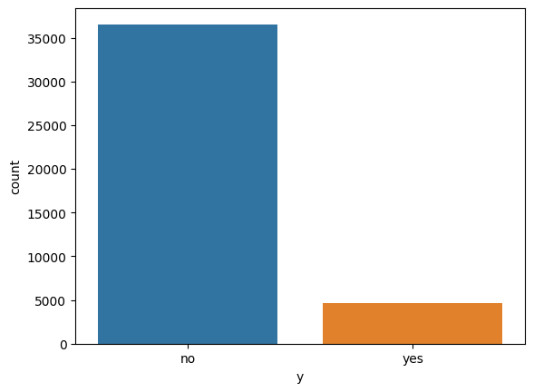
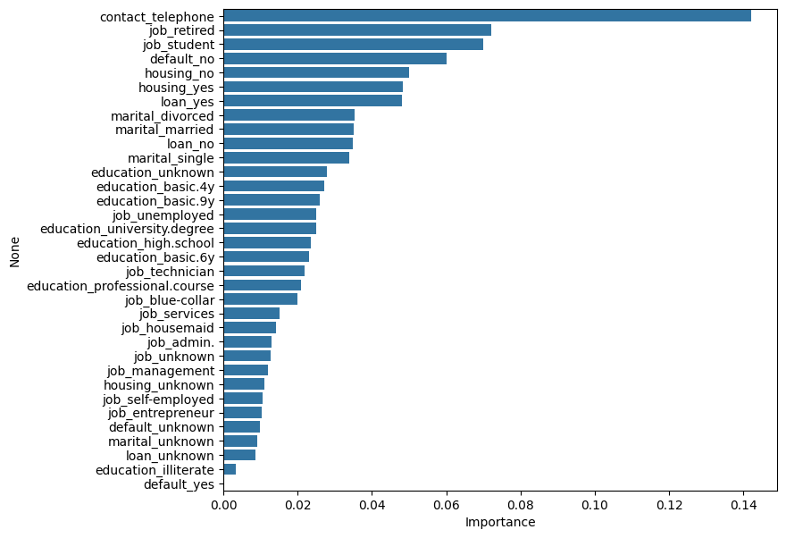
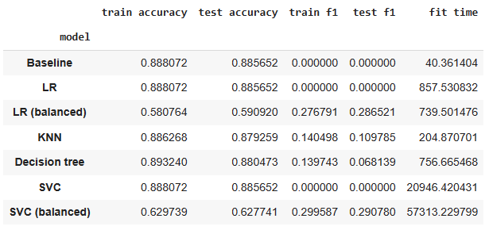

## Practical Application Assignment 17.1: Comparing Classifiers

This project was created as part of an online assignment for UC Berkeley's [Professional Certificate in ML &amp; AI](https://em-executive.berkeley.edu/professional-certificate-machine-learning-artificial-intelligence?advocate_program=01t2s000000ZqNbAAK&advocate_source=dashboard&coupon=IXFD6%3A11-8KE65G8&utm_campaign=incentivized_referrals&utm_content=SO+-+Berkeley+Professional+Certificate+in+ML+%26+AI&utm_medium=personal_url&utm_placement=dashboard&utm_source=referral&utm_term=U4i1l80W3GTaStzCNlN16AsmRVmMs3322wkrdiFJJXDjWY2Kl%2FSmYByqk28Z1wpPBt57rCVH9fEKu%2Bj%2B%2B2MnNXlRmW48YqIE%2Ff68xD%2BvB2eWYj%2BrPjaTIMN4--cMEm5pJ85sMlQO6a--ybrOaW%2FFOItWpgIey12Duw%3D%3D#referrals-email-capture-modal).

### Context and objectives

A financial institution based in Portugal has collected data for over 41,000 telemarketing calls made over a five-year period. It wishes to use this data to predict whether or not a sales lead may become a client in the future. Given the opportunity cost of missing out on a potential customer, the ultimate goal is to minimize the number of false negatives.

Because each lead either is or is not a customer, this is a binary classification problem. We implement several different models (such as *k*-nearest neighbors, logistic regression and support vector machines) to find the one with the highest predictive performance, and we also investigate methods to further optimize the models.

### Data

The data set contains 21 features:

#### Lead information

* `age` - the lead's age in years
* `marital` - the lead's marital status
* `education` - the lead's education level
* `default` - whether or not the lead has credit in default
* `housing` - whether or not the lead has a housing loan
* `loan` - whether or not has a personal loan
* `contact` - contact communication type

#### Campaign information

* `month` - last contact month of year
* `day_of_week` - last contact day of the week
* `duration` - duration of last call in seconds
* `campaign` - number of contacts performed during the campaign and for the particular lead
* `pdays` - number of days that passed since the client was last contacted from a previous campaign (999 if client was not previously contacted)
* `previous` - number of contacts performed before the campaign and for the particular lead
* `poutcome` - outcome of the previous marketing campaign

#### Social and economic attributes

* `emp.var.rate` - employment variation rate for the quarter
* `cons.price.idx` - consumer price index for the month
* `cons.conf.idx` - consumer confidence index for the month
* `euribor3m` - Euribor three-month rate for the day
* `nr.employed` - number of employees

#### Target variable

* `y` - whether or not the lead has subscribed to a term deposit

### Data cleaning

The data set contains no null values. It appears any missing data was replaced with "unknown" for all categorical variables.

Although no data cleaning was required for this exercise, a copy of the data set where "unknown" was replaced with the mode of the feature was used as comparison. However, this did not significantly affect the models' performance.

### Model selection and evaluation

Four classification models were tested in this study:

* Logistic regression
* *k*-nearest neighbors
* Decision trees
* Support vector machines

Based on the accuracy and F1 score, the `SVC` classifier had the best predictive performance.

**Please note:** Hyperparameter tuning was only done for the decision tree due to performance reasons. In a real-world scenario, the `SVC` model would have been further optimized.

### Findings

Some of our findings from the results include:

* Running `SVC` on the "mode" data set did not resolve in significant changes to the F1 score
* The decision tree shows that the factors with the greatest importance as follows:
  * Whether or not the lead was contacted by telephone
  * The lead's occupation, especially if they are a student or are retired
  * Whether or not the lead has credit in default
  * Whether or not the lead has a housing loan (a mortgage)
* Education has little effect on a lead's decision to become a customer
* Although the assignment suggests exploring the gender feature, no such feature exists in the data set
* Hyperparameter tuning did not significantly affect the results of the decision tree classifier

**Please note:** Due to performance reasons, only a subset of the original data was used for this exercise. In real-world scenarios, the use of additional features is likely to result in improved predictive performance.

#### Sample visualizations

* Distribution of `y`

* Feature importance

* Predictive performance

### Usage

Please see the [Google Colab tutorial](https://colab.research.google.com/drive/16pBJQePbqkz3QFV54L4NIkOn1kwpuRrj) for information on using Jupyter Notebooks.